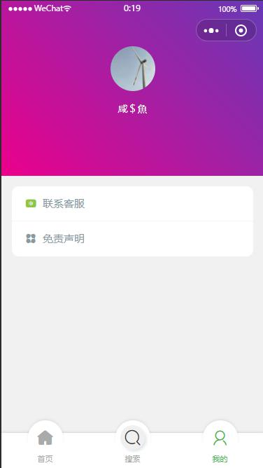
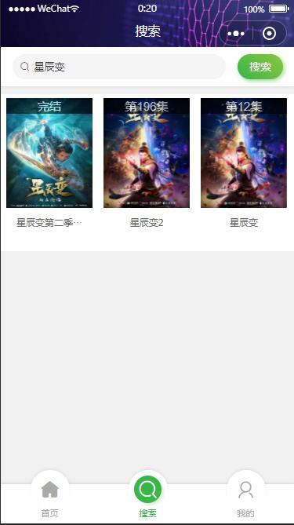
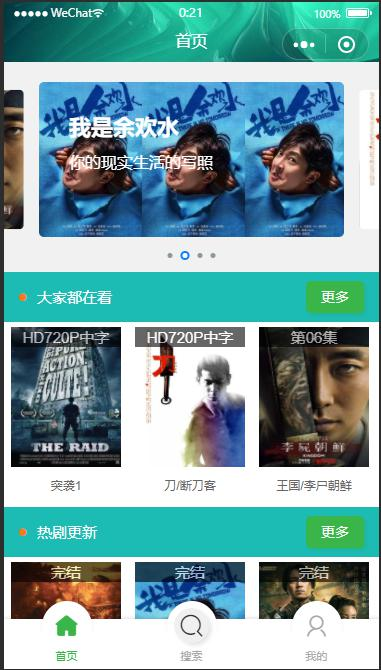
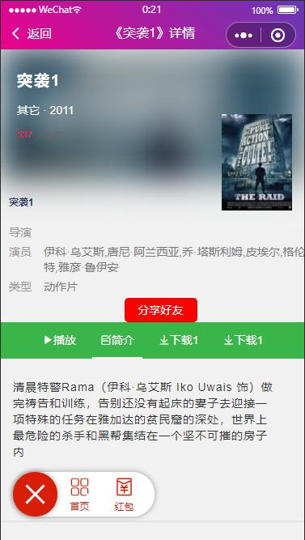
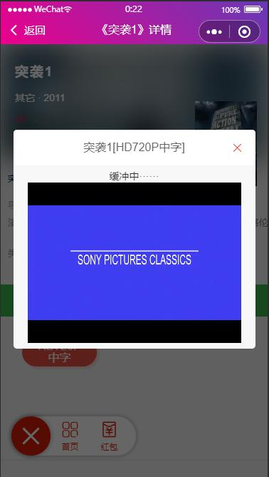

## 一、项目技术
    1.uni-app：使用Vue开发所有前端应用的框架。一套程序能够在各个平台上使用。对现在追求时间
    成本来说，无疑是个好东西。（学习：https://uniapp.dcloud.io/ ）  
    2.ColorUI：一个css库，优美的组件。对不精通css的后端，搬这一个砖也是可以的。
    （学习：https://github.com/weilanwl/ColorUI ）
 
## 二、运行
    1.将项目clone到本地使用HBuilder打开
    2.选中项目，点击菜单栏【运行】，选中运行的模拟器即可

## 三、效果图
1.我的  

2.搜索页

3.首页

4.详情页

5.弹窗播放

